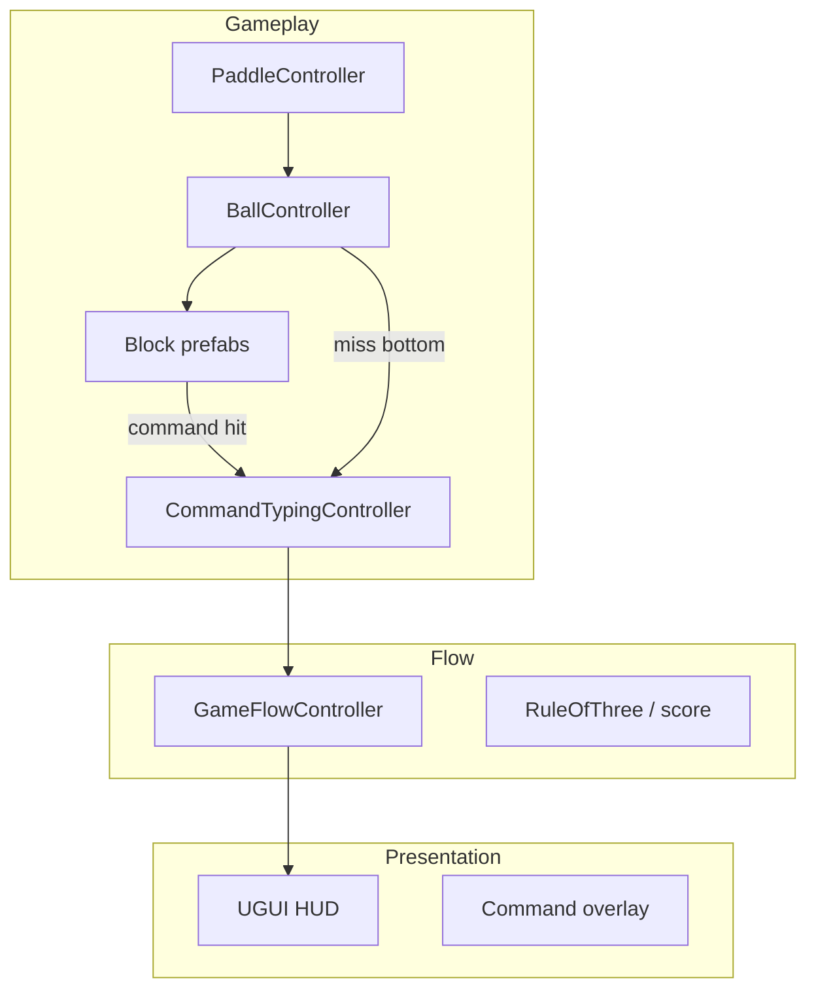

# Technical Overview — ACCESS GRANTED

> How the brick breaker + typing jam game is structured in Unity.

---

## Stack

- **Engine:** Unity 6 (2D, physics-based ball/paddle gameplay)
- **UI:** Standard Unity UI + TextMeshPro for terminal-style overlays
- **Targets:** WebGL (browser) primary, Windows standalone secondary
- **Input:** Keyboard (movement + typing); mouse for menus and serving

---

## High-Level Architecture

---

## Component Responsibilities

| Component | Responsibility |
|-----------|----------------|
| **PaddleController** | Horizontal movement, stay in bounds |
| **BallController** | Rigidbody2D movement + velocity caps; anti-stuck nudge; launch cone data-tuned; slow-ball multiplier via `PowerUpEffectsApplier` |
| **Block Prefabs** | HP, type (Standard–Heavy, pickup carriers, Command, Indestructible, Explosive), points; optional per-block `PowerUpDropMode` + pickup prefab |
| **CommandTypingController** | World-space falling prompts, no overlap (min ΔX/ΔY, resample); command spawn at block (tile persists until success); miss random X from top 1/5; `timeScale` 0.5 + wall-clock motion; max 2 active prompts, overflow = cancel + ball miss; paddle frozen; ball reattach + cooldown launch (random upward cone); full pause + WebGL blur auto-pause; level-won grace (bonus typing, no strike on fail) |
| **PowerUpEffectsApplier** | Applies WidePaddle, SlowBall, ScoreBurst effects |
| **GameFlowController** | States (playing, typing overlay, game over, level complete), rule-of-three counters, score calculation |

---

## Input Design

### Paddle (v1)
- **Keyboard only** — A/D and/or arrow keys
- No mouse-follow or gamepad for paddle in v1
- During typing mode, paddle input is ignored (frozen)

### Typing
- `Input.inputString` / Input System captures keystrokes
- Prompts appear as world-space UI elements
- Time scale reduced but prompt motion uses unscaled delta time

### WebGL Considerations
- Tab-focus/blur triggers auto-pause
- Click-to-start splash recommended for audio context

---

## Physics Approach

**Physics2D Implementation:**
- Rigidbody2D + colliders for familiar bounce behavior
- Tuned drag and max velocity
- Anti-stuck nudge system to prevent infinite horizontal loops

---

## Block Types

| Type | Behavior |
|------|----------|
| Standard | 1 HP, destroyed on hit |
| Heavy | 2-3 HP, multiple hits required |
| Command | Ball hit triggers typing challenge; immune to explosive neighbor damage |
| Indestructible | Cannot be destroyed; layout obstacles |
| Explosive | Chain reaction damage to neighbors on destruction |
| Pickup Carrier | Drops power-up on destruction |

---

## Typing Challenge Flow

1. **Trigger:** Ball hits command block OR ball exits bottom
2. **Slow-Mo:** `Time.timeScale = 0.5`
3. **Prompt Spawn:** Word appears at block position (command) or random X from top (miss)
4. **Input Capture:** Paddle frozen; player types word
5. **Resolution:** 
   - Success → command block destroyed / ball reattached
   - Fail → strike added to typing fail counter
6. **Resume:** `Time.timeScale = 1.0`

---

## Data Layer

- **Serialized fields on prefabs** for jam speed
- Optional JSON/ScriptableObjects for: command word list, per-level tuning (ball speeds with global scale + per-level curve), launch cone, anti-stuck parameters, typing window, block points, perfectMult, pickup tuning

---

## Build Configuration

- **Unity 6 LTS**
- **WebGL** + **Windows** standalone as first-class targets
- **UGUI + TextMeshPro** for overlays and HUD
- **Audio:** WebGL click-to-start splash for audio context

---

## UI Systems

| System | Purpose |
|--------|---------|
| HUD | Score, strike counters, level indicator |
| How to Play | Tutorial overlay |
| Settings | Master/music/SFX volume, CRT intensity (0=off) |
| Results | Score breakdown with Details toggle |
| Win + Credits | Level complete flow |

---

*ACCESS GRANTED — Gold Leaf Interactive — The Movie The Game The Jam 2026*
